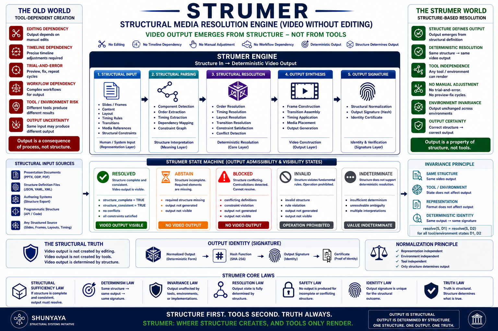

# ⭐ **STRUMER**

## **Structural Media Resolution — Video Without Editing**

   

   

   


---

**Reveals complete video output from structure — without editing.**

This reference engine demonstrates a strict invariant:

**video generation does not depend on editing, timelines, or manual workflows.**

It depends only on structure.

`video_visible iff video_structure_complete AND video_structure_consistent`

---

🚧 **This repository contains the canonical Phase I reference implementation.**

---

## 🎬 **STRUMER Demonstration Video**

https://www.youtube.com/watch?v=6Mk1A_maIqE

*(Generated entirely from structure — no editing, no timeline, no manual adjustment.)*  
*Demonstration uses extended `STRUMER_video_v2_7.py`.*

---

## 🌐 **STRUMER — Structural Media Resolution**

**Where Structure Resolves and Video Becomes Visible**

STRUMER removes editing as a dependency for video creation.

A video does not need editors, timelines, or manual adjustments to exist.

The video becomes visible only when structure resolves.

**Deterministic • Structure-Based • No Editing • No Timeline • No Manual Composition**

---

## ⚡ **The Claim**

A complete video can be generated without any editing — when structure is sufficient.

---

## 🧱 **Core Principle**

`video_visible iff video_structure_complete AND video_structure_consistent`

STRUMER proves that media output is determined by structural definition — not by editing tools, timelines, or manual workflows.

Editing may assist creation.  
**Structure alone determines the output.**

---

## ⚡ **30-Second Proof (Zero Editing Required)**

Run this single command:

```
python demo/strumer_v2_3.py
```

**What you will observe:**

• Complete structure → Video generated (RESOLVED)  
• Same structure → Identical video every time  
• Incomplete structure → No output (ABSTAIN)  
• Conflicting structure → No output (BLOCKED)  

This is the entire thesis in action.

If the same structure consistently produces the same video, editing sequence is no longer the source of correctness.

**Structure reveals the video. Tools only render it.**

Try it now.

No setup beyond Python 3.9+ and the listed dependencies.

---

## 🔁 **Determinism & Reproducibility**

STRUMER treats media as a reproducible structural artifact.

`same structure -> same video`

This enables:

- deterministic regeneration  
- structural diffability  
- reproducible media builds  
- audit-safe rendering  
- replay verification  
- large-scale template consistency  

Traditional editing workflows often depend on:
- manual adjustment
- environment drift
- editor state
- timeline interaction
- render variability

STRUMER reduces these dependencies through structure-defined generation.

The output is determined by structure — not by editing sequence.

---

## 📊 **Comparison**

| Model           | Editing Required | Structure-Based | Deterministic |
|----------------|------------------|-----------------|---------------|
| Video Editors  | Yes              | No              | Conditional   |
| Scripted Media | Partial          | Partial         | Conditional   |
| STRUMER        | No               | Yes             | Yes           |

STRUMER treats video as a deterministic structural artifact rather than a manually edited timeline artifact.

---

## 🧩 **Structural Vocabulary (Quick Reference)**

| Symbol | Meaning | State |
|-------|--------|------|
| `video_structure_complete` | All required elements (slides, timing, transitions) are defined | — |
| `video_structure_consistent` | No contradictions in layout, timing, or sequencing | — |
| `resolve(structure)` | Deterministic function that produces final video frames | — |
| `video_visible` | True **only** when structure is complete **AND** consistent | — |
| `certificate (σ)` | Deterministic structural fingerprint (SHA-256) of the generated output | — |
| 🟢 **RESOLVED** | Structure complete + consistent → **video becomes visible** | Output |
| 🟡 **ABSTAIN** | Structure incomplete → **no output forced** | Safe |
| 🔴 **BLOCKED** | Structure conflicting → **no arbitrary output allowed** | Safe |

---

## 🚀 **The Core Insight (30-Second Revolution)**

What if video creation never required editing tools?

Traditional systems assume:

`video requires editing`  
`layout requires manual adjustment`  
`timing requires trial and error`  
`output depends on tools`

STRUMER demonstrates:

When structure resolves, video becomes visible — deterministically.

`same structure -> same video`  
`incomplete structure -> no forced output`  
`conflicting structure -> no arbitrary output`

This is not a better editor.

**This is the removal of editing as a requirement.**

---

## 🧱 **The Unifying Principle**

`video_output = resolve(structure)`

If output remains after removing a dependency, that dependency was never fundamental.

---

## 🧩 **Structural Collapse Guarantee**

This framework does not modify visual output expectations.

It preserves them.

`phi((m, a, s)) = m`

Where:

m = final video output  
a = layout alignment  
s = structural definition  

No approximation.  
No manual tuning.  
`Same structure -> same video.`

---

## 🌍 **Civilizational Impact**

From editing-dependent media → structure-defined media.

Traditional video creation:  
Trial and error • manual adjustment • tool dependency  

STRUMER:  
Determinism • reproducibility • structure-first creation  

This is not only optimization.
It is structural dependency reduction through deterministic generation.

Editing sequence did not determine the video. 
**Structure did.**

---

## ⚠️ **Clarification — Video Without Editing**

STRUMER does not claim that tools never exist.

What STRUMER demonstrates:

Video output does not require editing tools as a prerequisite  
Tools may assist visualization or execution  
**Structure alone determines the output**

---

## 🧠 **Practical Interpretation**

Use tools for rendering if needed.

Use STRUMER to define the video.

STRUMER does not remove creative authorship.

It removes manual timeline dependency as the source of media correctness.

---

## 🧭 **Visual Overview**



---

## 🧩 **STRUMER-D — Diagrams Without Drawing**

**Structural Diagram Resolution**

STRUMER-D extends the same structural principle from video → diagrams.

No drawing tools. No layout tuning.  
Diagrams become visible when structure resolves.

`diagram_visible iff diagram_structure_complete AND diagram_structure_consistent`

Explore the diagram counterpart:

→ [Open STRUMER-D](STRUMER-D/)

---

## 🔊 **STRUMER-A — Audio Without Editing**

### **Structural Audio Resolution**

STRUMER-A extends the same structural principle from video → audio.

No audio editors. No waveform tuning.  
Audio becomes audible when structure resolves.

`audio_visible iff audio_structure_complete AND audio_structure_consistent`

Explore the structural audio counterpart:

→ [Open STRUMER-A](STRUMER-A/)

---

## 🖼 **STRUMER-I — Images Without Manual Construction**

### **Structural Image Resolution**

STRUMER-I extends the same structural principle from video → images.

No drawing workflows. No manual composition.  
Images become visible when structure resolves.

`image_visible iff image_structure_complete AND image_structure_consistent`

Explore the structural image counterpart:

→ [Open STRUMER-I](STRUMER-I/)

---

## 🧱 **Layer Separation (Critical)**

**Structure Layer:**  
Defines slides, timing, transitions  

**Capability Layer:**  
Rendering engine, codecs, libraries (optional)  

**Interface Layer:**  
Player, platform (YouTube, browser)  

**STRUMER operates only at the Structure Layer.**

---

## 🔍 **Truth vs Editing**

STRUMER determines video output — not editing process.

Editing may exist.  
It is not the source of output.

---

## 🔥 **Break This STRUMER (Immediate Challenge)**

If editing is required, this must fail:

`same structure -> same video`

Or demonstrate:

incomplete structure -> forced output  
conflicting structure -> arbitrary output  
tool change -> different output  

If none occur, editing is not fundamental.

---

## 🔥 **STRUMER Challenge — Where Structure Preserves Video Output Without Editing**

Explore real test scenarios where traditional media systems depend on editing tools, timelines, or manual workflows.
See how STRUMER preserves video output deterministically from structure alone.

→ [STRUMER Challenge](docs/STRUMER-Challenge.md)

---

## ⚡ **The Critical Line**

Across media creation:

remove editing → structure remains → video preserved

---

## ⚡ **The Core Truth**

`video != editing`  
`video = resolve(structure)`

You don’t edit videos.  
**You define them.**

---

## ⚡ **Structural Absence Principle**

If structure is not complete and consistent:

no video exists  

`incomplete -> ABSTAIN`  
`conflict -> BLOCKED`

---

## 🧩 **From Minimal Proof to Media Systems**

This is a minimal proof.

Future STRUMER systems may expand into:

automated media pipelines  
multi-format structural generation  
real-time structural video systems  
AI + structure hybrid media  
domain-specific structural templates  

Invariant remains:

`same structure -> same video`

---

## 🧩 **Reference Demonstration**

Scenario 1 — Valid Structure  
→ Video Generated  

Scenario 2 — Incomplete Structure  
→ ABSTAIN  

Scenario 3 — Conflict  
→ BLOCKED  

Expected outcome:

same structure -> same video file  
modify one line -> new deterministic video  
rerun -> identical visible output if unchanged

---

## 🧭 **Framework & References**

### **Docs**
- [Quickstart](docs/Quickstart.md)  
- [FAQ](docs/FAQ.md)  
- [Proof Sketch](docs/Proof-Sketch.md)  
- [STRUMER Architecture (PDF)](docs/STRUMER_v1.2.pdf)  
- [STRUMER Concept Diagram](docs/STRUMER-Diagram.png)  

---

**Note:**  
Video identity shown in the STRUMER concept diagram is illustrative.  
In Phase I, output identity depends on structural definition.  
Canonical identity is a future extension.

---

### **Framework**

- [STRUMER Architecture Notes](docs/STRUMER-Architecture-Notes.md)  
- [Dependency Elimination Framework](docs/Dependency-Elimination-Framework.png)  
- [Shunyaya Structural Stack](docs/Shunyaya-Structural-Stack.png)  

---

STRUMER is part of the **Dependency Elimination Framework**, where:

`video_output = resolve(structure)`

Removing assumed dependencies does not break output —  
it reveals that output was always determined by structure.

---

## 🧪 **Demo**

### 🎬 STRUMER (Video Without Editing)
- [Python Reference](demo/strumer_v2_3.py)  
- [HTML Visual Demo](demo/STRUMER_HTML_v2_3.html)  
- [Video Demo Script (v2.7)](demo_extension/STRUMER_video_v2_7.py)

### 🧩 STRUMER-D (Diagrams Without Drawing)
- [STRUMER-D Diagram Script (v2.0)](STRUMER-D/strumer_d_v2_0.py)  
- [STRUMER-D Video Script (v1.8.5)](STRUMER-D/STRUMER_D_video_v1_8_5.py)  
- [STRUMER-D Folder](STRUMER-D/)

### 🔊 STRUMER-A (Audio Without Editing)
- [STRUMER-A Reference Script (v1.3)](STRUMER-A/strumer_a_v1_3.py)  
- [STRUMER-A Video Script (v1.9)](STRUMER-A/STRUMER_A_video_v1_9.py)  
- [STRUMER-A Folder](STRUMER-A/)  
- [Waveform Validation Artifact](STRUMER-A/STRUMER_A_v1_3_waveform.png)

---

### 🖼 STRUMER-I (Images Without Manual Construction)
- [STRUMER-I Reference Script (v1.1)](STRUMER-I/strumer_i_v1_1.py)  
- [STRUMER-I Folder](STRUMER-I/)  
- [Canonical Resolved Image](STRUMER-I/STRUMER_I_v1_1.png)  
- [Deterministic Replay Image](STRUMER-I/STRUMER_I_v1_1_repeat.png)  
- [Changed Structural Image](STRUMER-I/STRUMER_I_v1_1_changed.png)  
- [Incomplete Structural State](STRUMER-I/STRUMER_I_v1_1_incomplete.png)  
- [Conflict Structural State](STRUMER-I/STRUMER_I_v1_1_conflict.png)

---

## 🔐 **Verification & Reproducibility**

### **Quick Determinism Check**

```
python demo/strumer_v2_3.py
```

```
python demo/strumer_v2_3.py
```

**Run again — output must be identical**

---

### **File Integrity (SHA-256 Freeze)**

`demo\strumer_v2_3.py`  
SHA256: `cb03fe9bc4775c780714bd7a2105ef9b53cfc7a0d6fbce08132db2cbe05efa4d`

`demo\STRUMER_HTML_v2_3.html`  
SHA256: `c11a4c4e230e87ca674e4ba2deb453b7be64fe98f9709e09be3a2126abcb104f`

Full verification checklist and expected states are available in:

`VERIFY/VERIFY.txt`

### **Core Guarantee**

`same structure -> same video -> same output signature`

### **Tool / Environment Stability Target**

Changing:

- Python version  
- Operating system  
- Rendering libraries  

should not change output when rendering dependencies are equivalently pinned.

**Only structure determines the result.**

---

## 🧠 **Why Determinism Matters**

Deterministic media enables:

- reproducible compliance reporting  
- audit-safe publishing  
- replay verification  
- scalable personalization  
- structural diffability  
- regression testing for media pipelines  

This moves media generation closer to reproducible software builds.

---

## 📁 **Repository Structure**

- `demo/` — STRUMER reference script + visual demo  
- `demo_extension/` — extended STRUMER video demonstration script  
- `STRUMER-D/` — structural diagram resolution scripts, generated diagram artifacts, and STRUMER-D video script
- `STRUMER-A/` — structural audio resolution script, generated audio artifacts, waveform validation, and VERIFY report
- `STRUMER-I/` — structural image resolution engine, deterministic image artifacts, replay validation outputs, manifests, and structural verification reports
- `docs/` — conceptual, architectural, and formal documentation  
- `VERIFY/` — reproducibility and integrity checks

---

## 🛡 **Structural Safety & Guarantees**

STRUMER never forces output.

`incomplete -> no video`  
`conflict -> no output`  
`complete -> deterministic output`

---

## 🔥 **Deterministic Invariant**

`same structure -> same video`

`same structure -> same video -> same output signature`

---

## 🧾 **Structural Lineage**

SLANG → execution  
STIME → time  
STINT → connectivity  
STILE → communication  
SVARE → computation  
STRUMER → media

---

## ⚖️ **What STRUMER Is / Is Not**

### **STRUMER IS:**

a structural media generation model  
deterministic video creation from structure  
a minimal reference engine  
part of Shunyaya framework

### **STRUMER IS NOT:**

a video editor  
a rendering optimization tool  
a production media pipeline (Phase I)

---

## 📜 **License**

See: [LICENSE](LICENSE)

### **Reference Implementation (This Repository):**

This STRUMER reference engine (Python + media demo) is released as an **Open Standard** —  
free to use, study, implement, extend, and deploy.

It represents a minimal deterministic demonstration of structural media resolution.

### **Architecture and Documentation:**

Licensed under CC BY-NC 4.0

---

## ⚠️ **Known Limitations (Phase I)**

This is a minimal reference implementation designed to prove the structural principle.

### **Current scope:**

Slide-based video only (text + simple layout)  
Basic transitions (fade-based; no complex animation system)  
Offline generation (no real-time or streaming output)  
Not a full production media pipeline

### **What Phase I deliberately does NOT claim:**

Replacement for professional video editors  
Support for advanced motion graphics or VFX  
Production-grade performance or scalability guarantees

### **Phase I objective:**

Demonstrate that:

`video_output = resolve(structure)`

Video output can exist independently of editing dependency.

Everything beyond this is future expansion.

### **Contribution direction:**

We welcome extensions that expand capability without breaking the core invariants:

`same structure -> same video`  
`incomplete -> ABSTAIN`  
`conflict -> BLOCKED`

---

### **What STRUMER Demonstrates Clearly**

Phase I strongly demonstrates:

- deterministic media generation  
- structure-defined output  
- replay-safe rendering  
- reusable structural templates  
- editing-independent slide/video generation  
- structural admissibility (RESOLVED / ABSTAIN / BLOCKED)

The current scope focuses on structured, template-driven media systems.

---

## 🔭 **Roadmap**

Multi-format generation  
Structural animation engines  
Real-time structural media  
Canonical output identity  
CLI + Web interface

---
## 🧱 **Cross-System Dependency Elimination Map**

Across these systems, the same structural pattern appears repeatedly.

The dependency changes.  
The preserved invariant does not.

| Domain        | System | Removed Dependency                  | What Preserves Correctness |
|---------------|--------|------------------------------------|----------------------------|
| Computation   | [SLANG-Computation](https://github.com/OMPSHUNYAYA/SLANG-Computation) | Execution flow             | Structure |
| Computation   | [STOCRS](https://github.com/OMPSHUNYAYA/STOCRS)                     | Execution pipelines        | Structure |
| Arithmetic    | [SVARE](https://github.com/OMPSHUNYAYA/SVARE)                        | Computation                | Structure |
| Time          | [STIME](https://github.com/OMPSHUNYAYA/Structural-Time)              | Clocks                     | Structure |
| Time          | [SSUM-Time](https://github.com/OMPSHUNYAYA/SSUM-Time)                | Time reconstruction        | Structure |
| Ordering      | [ORL](https://github.com/OMPSHUNYAYA/Orderless-Ledger)              | Ordering / sequence        | Structure |
| Connectivity  | [STINT-Money](https://github.com/OMPSHUNYAYA/STINT-Money)           | Continuous connectivity    | Structure |
| Communication | [STILE](https://github.com/OMPSHUNYAYA/STILE)                       | Messaging / network        | Structure |
| Traversal     | [STRAL-Path](https://github.com/OMPSHUNYAYA/STRAL-Path)             | Traversal / search         | Structure |
| Infrastructure| [STIC](https://github.com/OMPSHUNYAYA/STIC)                         | Cloud / infrastructure     | Structure |
| Media         | [STRUMER](https://github.com/OMPSHUNYAYA/STRUMER)                    | Editing / manual media workflows | Structure |
| Finance       | [SLANG-Money](https://github.com/OMPSHUNYAYA/SLANG-Money)           | Transactions               | Structure |
| Audit         | [SLANG-Audit](https://github.com/OMPSHUNYAYA/SLANG-Audit)           | Verification workflows     | Structure |

Each row demonstrates a reduction of runtime dependency through structure.

Correctness remains reproducible under structural constraints.

Dependencies may shift from runtime coordination toward structural definition,
while preserving deterministic outcomes.

If correctness remains stable after reducing a dependency,
that dependency may not be fundamental to correctness.

---

## 🌌 **The Unifying Insight**

remove dependency → structure remains → output preserved

---

## 📝 **Note on Naming**

Shunyaya is an original modern structural and mathematical framework developed by the authors of the Shunyaya Framework.

It is distinct from Shunyata and is not a restatement of any prior philosophical term or doctrine.

---

## 🧭 **Final Statement**

Editing sequence did not determine the video.
Tools rendered it. Structure determined it.

The video is structurally determined before it is rendered.

When structure is complete and consistent:  
video becomes visible.

Deterministically.  
Reproducibly.  
Independently of editing.

**This is STRUMER.**
